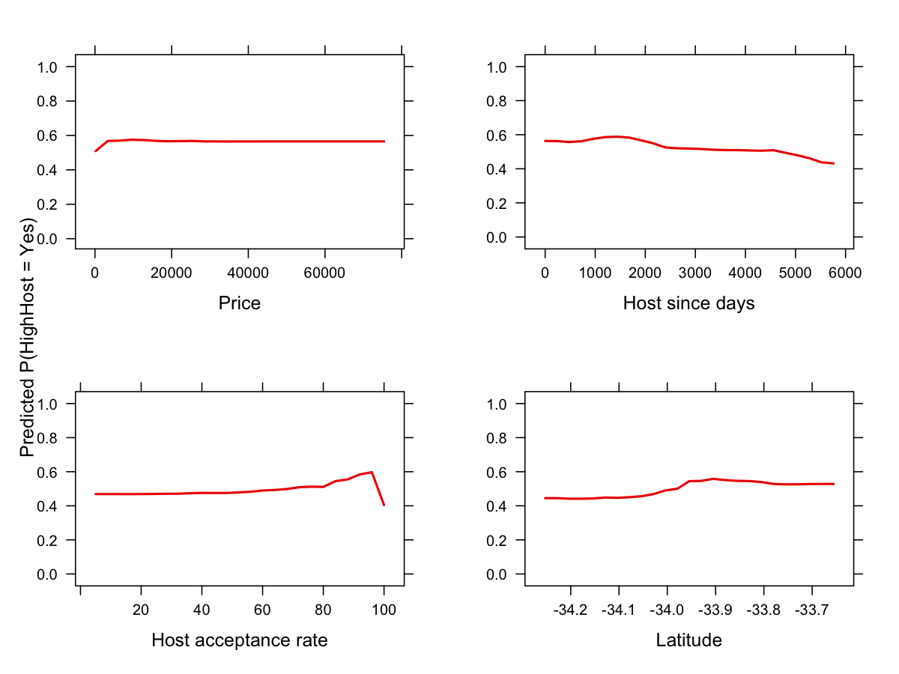

```{r, echo = FALSE, warning = FALSE, message = FALSE}
# Required Package Installation:
library(tidyverse)
library(dplyr)
library(glmnetUtils)
library(randomForest)
library(gbm)
library(caret)
library(ggplot2)
library(pROC)
library(pdp)
library(vip)
library(grid)
library(gridExtra)
library(kableExtra)
```

```{r, echo = FALSE}
# Loading Data Set:
listings <- read.csv("listings.csv")
```

## Question 1:

### Target Variable Creation:

```{r echo = FALSE}
# Training & Test Set Split (Raw Data)
set.seed(2026)

n <- nrow(listings)
trainIndex <- sample(seq_len(n), size = floor(0.8 * n))

trainDataC <- listings |> dplyr::slice(trainIndex)
testDataC  <- listings |> dplyr::slice(-trainIndex)
```


```{r}
hostUniqueTrain <- trainDataC |>
  distinct(host_id, host_listings_count)

xValues <- 1:6

imbalanceByX <- data.frame(
  x = xValues,
  HighHost = sapply(xValues, function(x) {
    mean(hostUniqueTrain$host_listings_count > x) * 100
  })
)

imbalanceByX$Not_HighHost <- 100 - imbalanceByX$HighHost

imbalanceLong <- imbalanceByX |>
  pivot_longer(cols = c(HighHost, Not_HighHost),
               names_to = "Class",
               values_to = "Percentage")

ggplot(imbalanceLong, aes(x = x, y = Percentage, colour = Class)) +
  geom_line(linewidth = 1) +
  geom_point(size = 2) +
  scale_x_continuous(breaks = 1:6) +
  labs(
    x = "x",
    y = "Percentage",
    colour = "Classification"
  ) +
  theme_minimal()
```

```{r}
library(dplyr)
library(knitr)

hostUniqueTrain <- trainDataC |>
  distinct(host_id, host_listings_count)

HHtrain <- round(mean(hostUniqueTrain$host_listings_count > 2) * 100, 2)
nHHtrain <- round(100 - HHtrain, 2)

hostUniqueTest <- testDataC |>
  distinct(host_id, host_listings_count)

HHtest <- round(mean(hostUniqueTest$host_listings_count > 2) * 100, 2)
nHHtest <- round(100 - HHtest, 2)

imbalanceTable <- data.frame(
  Dataset = c("Training", "Test"),
  HighHost = c(HHtrain, HHtest),
  Not_HighHost = c(nHHtrain, nHHtest)
)

latexTable <- kable(
  imbalanceTable,
  caption = "Class imbalance for x = 2 on the training and test data",
  col.names = c("Dataset", "HighHost (%)", "Not HighHost (%)"),
  format = "latex",
  booktabs = TRUE,
  align = c("l", "c", "c")
)

cat(latexTable)
```

$$
\text{HighHost} =
\begin{cases}
1 & \text{if } \text{host_listings_count} > 2. \\
0 & \text{otherwise}
\end{cases}
$$

```{r echo = FALSE}
hostCutoff = 2

# Binary Response: 1 = Yes, 0 = No
listings$host_listings_count <- ifelse(listings$host_listings_count > 2, 1, 0)

listings <- listings |>
  rename(HighHost = host_listings_count)
```

## Question 2:

### a)

```{r echo = FALSE}
# Training & Test Set Split With HighHost
set.seed(2026)

n <- nrow(listings)
trainIndex <- sample(seq_len(n), size = floor(0.8 * n))

trainData <- listings |> dplyr::slice(trainIndex)
testData  <- listings |> dplyr::slice(-trainIndex)
```

```{r, echo = false}
library(ggplot2)

ggplot(trainData, aes(x = longitude, y = latitude, colour = neighbourhood_ward)) +
  geom_point(size = 1, alpha = 0.6) +
  labs(
    x = "Longitude",
    y = "Latitude",
    colour = "Ward"
  ) +
  theme_minimal() +
  theme(
    legend.position = "none"
  )
```

#### Data Pre-Processing:

```{r echo = FALSE}
# Remove id (Useless), host_id (Target Leakage Prevention) neighbourhood_ward (Collinear With Longitude & Latitude and Problematic):

  trainData <- trainData |>
    select(-id, -host_id, -neighbourhood_ward)
  
  testData <- testData |>
    select(-id, -host_id, -neighbourhood_ward)

# Convert host_since to a Usable Numeric Predictor:

  # Convert host_since to Date:
  trainData$host_since <- as.Date(trainData$host_since, format = "%Y/%m/%d")
  testData$host_since  <- as.Date(testData$host_since, format = "%Y/%m/%d")
  
  # Use Training Data to Define the Reference Date:
  minHostSince <- min(trainData$host_since)
  
  # Create Numeric Variable host_since_days:
  trainData$host_since_days <- as.numeric(trainData$host_since - minHostSince)
  testData$host_since_days  <- as.numeric(testData$host_since - minHostSince)
  
  # Remove host_since:
  trainData <- trainData |>
    select(-host_since)
  
  testData <- testData |>
    select(-host_since)
  
# Transform host_verifications into Usable Binary Features:
  
  # Binary Indicator Creation:
  trainData$has_email_verification <- ifelse(grepl("email", trainData$host_verifications), 1, 0)
  testData$has_email_verification  <- ifelse(grepl("email", testData$host_verifications), 1, 0)
  
  trainData$has_phone_verification <- ifelse(grepl("phone", trainData$host_verifications), 1, 0)
  testData$has_phone_verification  <- ifelse(grepl("phone", testData$host_verifications), 1, 0)
  
  trainData$has_work_email_verification <- ifelse(grepl("work_email", trainData$host_verifications), 1, 0)
  testData$has_work_email_verification  <- ifelse(grepl("work_email", testData$host_verifications), 1, 0)
  
  # Remove host_verifications:
  trainData <- trainData |>
    select(-host_verifications)
  
  testData <- testData |>
    select(-host_verifications)

# Transform Categorical Variables to be Factors:
  
  # *MIGHT NEED TO ENFORCE OBSERVATIONS CONTAINING NA DROPPING IN THE CASE THE MODEL ENCOUNTERS A FACTOR LEVEL IT HAS NEVER SEEN BEFORE WHEN BEING TESTED ON THE "UNSEEN" TEST DATA*
  
  # host_response_time:
  trainData$host_response_time <- as.factor(trainData$host_response_time)
  testData$host_response_time  <- factor(testData$host_response_time, levels = levels(trainData$host_response_time))
  
  # host_is_superhost
  trainData$host_is_superhost <- as.factor(trainData$host_is_superhost)
  testData$host_is_superhost  <- factor(testData$host_is_superhost, levels = levels(trainData$host_is_superhost))
  
  # room_type
  trainData$room_type <- as.factor(trainData$room_type)
  testData$room_type  <- factor(testData$room_type, levels = levels(trainData$room_type))
  
  # instant_bookable
  trainData$instant_bookable <- as.factor(trainData$instant_bookable)
  testData$instant_bookable  <- factor(testData$instant_bookable, levels = levels(trainData$instant_bookable))
  
# HighHost Variable Classes Required for Model Types:
  
  # Elastic Net : Numeric
  # Random Forest : Factor
  # GBM : Factor
  # KNN : Factor
```

#### Regularised Elastic-Net Logistic Regression:

```{r, echo = FALSE}
  elasticNetResultsFile <- "elasticNetResults.RData"
  elasticNetFile <- "elasticNetModel.RData"

if (file.exists(elasticNetFile) && file.exists(elasticNetResultsFile))
{
  load(elasticNetFile)
  load(elasticNetResultsFile)
} else 
{
  set.seed(2026)
alphaGrid <- seq(0,1, by = 0.01)

elasticNetResults <- lapply(alphaGrid, function(a) {  
  elasticNetFits <- glmnetUtils::cv.glmnet(
    HighHost ~ .,
    data = trainData,
    family = "binomial",
    alpha = a,       
    nfolds = 10,
    type.measure = "auc",
    trace.it = FALSE
  )
  index <- which.min(abs(elasticNetFits$lambda - elasticNetFits$lambda.min))
  
  coeficients <- coef(elasticNetFits, s = "lambda.min")
  n_nonzero <- sum(as.vector(coeficients)[-1] != 0) 
  
  list(
    fit = elasticNetFits,
    summary = data.frame(alpha = a,
      lambda_min = elasticNetFits$lambda.min,
      auc = elasticNetFits$cvm[index]),
      se = elasticNetFits$cvsd[index],
      lambda_min = elasticNetFits$lambda.min,
      lambda_1se = elasticNetFits$lambda.1se,
      n_nonzero = n_nonzero
  )
})
  

  elasticNetResults <- do.call(rbind, 
    lapply(elasticNetResults, function(x) x$summary)
    )
  
  best_index_EN <- which.max(elasticNetResults$auc)
  best_alpha_EN <- elasticNetResults$alpha[best_index_EN]
  best_auc <- elasticNetResults$auc[best_index_EN] 
  best_se <- elasticNetResults$se[best_index_EN]
  
  elasticNetModel <- glmnetUtils::cv.glmnet(
    HighHost ~ .,
    data = trainData,
    family = "binomial",
    alpha = best_alpha_EN,       
    nfolds = 10,
    type.measure = "auc",
    trace.it = TRUE
  )
  
  
  save(elasticNetResults, file = elasticNetResultsFile)
  save(elasticNetModel, file = elasticNetFile) # Change to save the best model (may need to rerun the best model)
}
```

```{r, echo = FALSE}
plot(elasticNetResults$alpha, elasticNetResults$auc,
     type = "l",
     ylab = "AUROC",
     xlab = "Alpha Value")

index_en <- which.max(elasticNetResults$auc)

points(elasticNetResults$alpha[index_en], elasticNetResults$auc[index_en], pch = 19) 

#veritcal line
x_left <- par("usr")[1]
segments(x0 = x_left, y0 = elasticNetResults$auc[index_en],
         x1 = elasticNetResults$alpha[index_en],               y1 = elasticNetResults$auc[index_en],
         lty = 3)

#horizontal line
y_bottom <- par("usr")[3]
segments(x0 = elasticNetResults$alpha[index_en], y0 = y_bottom,
         x1 = elasticNetResults$alpha[index_en], y1 = elasticNetResults$auc[index_en],
         lty = 3)

text(x = elasticNetResults$alpha[index_en],
     y = y_bottom,
     labels = paste0("alpha = ", elasticNetResults$alpha[index_en]),
     pos = 1,      
     xpd = NA)


print(elasticNetModel)
coef(elasticNetModel, s = "lambda.min")
plot(elasticNetModel, ylab = "AUROC") #check werid plateau at 1 factor
```

```{r, echo = FALSE}
trainData$HighHost <- factor(trainData$HighHost, levels = c(0, 1), labels = c("No", "Yes"))
testData$HighHost  <- factor(testData$HighHost, levels = c(0, 1), labels = c("No", "Yes"))
```

#### Random Forest:

```{r, echo = FALSE}

  rfResultsFile <- "rfResults.RData"
  randomForestFile <- "randomForestModel.RData"

if (file.exists(randomForestFile) && file.exists(rfResultsFile)) {
  load(randomForestFile)
  load(rfResultsFile)
} else {

  set.seed(2026)
  
  foldid <- sample(rep(1:10, length.out = nrow(trainData)))
  
  p <- ncol(trainData) - 1
  
  mtry_grid <- c(2,4,6,8,10,12)
  
  ntree_grid <- c(100, 200, 300)
  
  nodesize_grid <- c(1,5,10)
  
  rfGrid <- expand.grid(
    mtry = mtry_grid,
    ntree = ntree_grid,
    nodesize = nodesize_grid
    )      
  
  
rfResults <- lapply(1:nrow(rfGrid), function(i) {
  this_mtry     <- rfGrid$mtry[i]
  this_ntree    <- rfGrid$ntree[i]
  this_nodesize <- rfGrid$nodesize[i]
  
  fold_auc <- numeric(10)
  
  for (k in 1:10) {
    
    train_fold <- trainData[foldid != k, ]
    valid_fold <- trainData[foldid == k, ]
    
    rf_fit <- randomForest(
      HighHost ~ .,
      data = train_fold,
      mtry = this_mtry,
      ntree = this_ntree,
      nodesize = this_nodesize
    )
    
    prob_yes <- predict(rf_fit, newdata = valid_fold, type = "prob")[, "Yes"]
    
    fold_auc[k] <- as.numeric(
      auc(
        roc(response = valid_fold$HighHost,
            predictor = prob_yes,
            levels = c("No", "Yes"),
            direction = "<")))
  }
  
  data.frame(
    mtry = this_mtry,
    ntree = this_ntree,
    nodesize = this_nodesize,
    mean_auc = mean(fold_auc),
    sd_auc = sd(fold_auc))
})
  
  rfResults <- do.call(rbind, rfResults)
  

 
  best_model_rf <- data.frame(
    mtry = 4,
    ntrees = 200,
    nodesize = 5
  )
  
  save(rfResults, file = rfResultsFile)
  
  randomForestModel <- randomForest(
    HighHost ~ .,
    data = trainData,
    ntree = best_model_rf$ntree,
    mtry = best_model_rf$mtry, 
    nodesize = best_model_rf$nodesize,
    importance = TRUE,
    do.trace = 50
  )
  
  
  save(randomForestModel, file = randomForestFile)
  
  
#  save(randomForestModel, file = randomForestFile)
}
```

```{r, echo = FALSE}

library(ggplot2)

chosenPoint <- data.frame(
  mtry = 4,
  ntree = 200,
  nodesize = 5
)

chosenPoint <- merge(
  chosenPoint,
  rfResults,
  by = c("mtry", "ntree", "nodesize")
)

ggplot(rfResults, aes(x = ntree, y = mean_auc,
                      colour = factor(nodesize),
                      group = factor(nodesize))) +
  geom_line() +
  geom_point(size = 2) +
  geom_point(
    data = chosenPoint,
    aes(x = ntree, y = mean_auc),
    inherit.aes = FALSE,
    shape = 21,
    size = 2.5,
    stroke = 1.5,
    fill = "gold",
    colour = "black"
  ) +
  facet_wrap(~ mtry, scales = "fixed", labeller = label_both) +
  labs(
    x = "Number of Trees",
    y = "AUROC",
    colour = "Node Size",
  ) +
  theme_minimal()


plot(randomForestModel$err.rate[, "OOB"], type = "l", xlab = "Number of Trees", ylab = "OOB Error", col = "blue", lwd = 2, ylim = c(0, max(randomForestModel$err.rate[, "OOB"])), main = "Random Forest Model: OOB Error vs Number of Trees")
#print(randomForestModel)
#importance(randomForestModel)
#varImpPlot(randomForestModel)
```

#### GBM Boosted Tree Model:

```{r, echo = FALSE}
if (file.exists("gbmTuningObjects.RData")) {
  load("gbmTuningObjects.RData")
} else {
  set.seed(2026)

  gbmControl <- trainControl(
  method = "cv",
  number = 10,
  classProbs = TRUE,
  summaryFunction = twoClassSummary,
  verboseIter = TRUE
  )
  
  gbmGrid <- expand.grid(
    n.trees = c(100, 200, 300, 400, 500),
    interaction.depth = c(8, 10),
    shrinkage = c(0.05, 0.075, 0.1),
    n.minobsinnode = c(5, 10, 20)
  )
  
  gbmCaretModel <- train(
    HighHost ~ .,
    data = trainData,
    method = "gbm",
    trControl = gbmControl,
    tuneGrid = gbmGrid,
    metric = "ROC",
    verbose = FALSE
  )
  
  best_model_gbm <- gbmCaretModel$bestTune
  best_model_gbm
  
  save(gbmCaretModel, best_model_gbm, gbmGrid, gbmControl, file = "gbmTuningObjects.RData")
}
```

GBM BOOSTED TREE MODEL TUNING:

```{r, echo = FALSE}
load("gbmTuningObjects.RData")

chosenPoint <- data.frame(
  n.trees = 300,
  interaction.depth = 8,
  shrinkage = 0.075,
  n.minobsinnode = 20
)

# Get its AUROC value from the tuning results
chosenPoint <- merge(
  chosenPoint,
  gbmCaretModel$results,
  by = c("n.trees", "interaction.depth", "shrinkage", "n.minobsinnode")
)

ggplot(
  gbmCaretModel$results,
  aes(
    x = n.trees,
    y = ROC,
    colour = factor(n.minobsinnode),
    group = factor(n.minobsinnode)
  )
) +
  geom_line() +
  geom_point(size = 2) +
  geom_point(
    data = chosenPoint,
    aes(x = n.trees, y = ROC),
    inherit.aes = FALSE,
    shape = 21,
    size = 2.5,
    stroke = 1.5,
    fill = "gold",
    colour = "black"
  ) +
  facet_grid(shrinkage ~ interaction.depth, labeller = label_both) +
  scale_x_continuous(breaks = c(100, 200, 300, 400, 500)) +
  labs(
    x = "Number of Trees",
    y = "Mean CV AUROC",
    colour = "Min # of Obs in Node"
  ) +
  theme_minimal() +
  theme(
    axis.text.x = element_text(size = 5.5),
    axis.text.y = element_text(size = 7)
  )

```

#### K-Nearest Neighbours Model:

```{r, echo = FALSE}
load("gbm_all_objects.RData")
importanceTable <- summary(gbmModel, n.trees = 300, plotit = FALSE)

top7 <- importanceTable[1:7, ]

par(mar = c(5, 14, 4, 2) + 0.1, las = 1)

barplot(
  rev(top7$rel.inf),
  names.arg = rev(top7$var),
  horiz = TRUE,
  col = "grey",
  border = "black",
  xlab = "Relative Influence",
  cex.names = 1.4,
  cex.lab = 1.4
)
```

```{r echo = FALSE}
# K-NEAREST NEIGHBOURS FITTING:

featureSets <- list(
  
  Subset1 = c("host_acceptance_rate", "host_response_time", "host_since_days"),

  Subset2 = c("host_acceptance_rate", "host_response_time", "host_since_days", "host_response_rate"),

  Subset3 = c("host_acceptance_rate", "host_response_time", "host_since_days", "host_response_rate", "minimum_nights"),

  Subset4 = c("host_acceptance_rate", "host_response_time", "host_since_days", "host_response_rate", "minimum_nights", "latitude"),

  Subset5 = c("host_acceptance_rate", "host_response_time", "host_since_days", "host_response_rate", "minimum_nights", "latitude", "price"))

if (file.exists("knn_all_objects.RData")) {
  load("knn_all_objects.RData")
} else {
  set.seed(2026)

  knnControl <- trainControl(
    method = "cv",
    number = 10,
    classProbs = TRUE,
    summaryFunction = twoClassSummary,
    verboseIter = TRUE
  )
  
  knnGrid <- expand.grid(k = seq(1, 25, by = 1))

  knnFits <- list()
  knnResults <- list()

  for (setName in names(featureSets)) 
  {
  
    vars <- featureSets[[setName]]
    
    trainSubset <- trainData[ , c(vars, "HighHost")]
    
    knnFit <- train(
      HighHost ~ .,
      data = trainSubset,
      method = "knn",
      trControl = knnControl,
      tuneGrid = knnGrid,
      metric = "ROC",
      preProcess = c("center", "scale")
    )
    
    knnFits[[setName]] <- knnFit
    
    temp <- knnFit$results
    temp$FeatureSet <- setName
    knnResults[[setName]] <- temp
  }

  knnResults <- do.call(rbind, knnResults)
  
  best_knn <- knnResults[which.max(knnResults$ROC), ]
  
  save(
    knnFits,
    knnResults,
    best_knn,
    featureSets,
    knnGrid,
    file = "knn_all_objects.RData"
  )
}
```

```{r echo = FALSE}
# K-NEAREST NEIGHBOURS TUNING:
load("knn_all_objects.RData")

ggplot(
  knnResults,
  aes(
    x = k,
    y = ROC,
    colour = FeatureSet,
    group = FeatureSet
  )
) +
  geom_line() +
  geom_point(size = 2) +
  labs(
    x = "Number of Neighbours (k)",
    y = "Mean AUROC",
    colour = "Feature Set"
  ) +
  theme_minimal()
```

### b)

#### 5 Model Performance Metric Summary:

```{r, echo = FALSE}

index_lambda_en <- which.min(abs(elasticNetModel$lambda-elasticNetModel$lambda.min))

en_outoffold_prob <- elasticNetModel$fit.preval[,index_lambda_en]
en_outoffold_pred <- ifelse(en_outoffold_prob >= 0.5, 1, 0)

y_true_en <- ifelse(trainData$HighHost == "Yes", 1, 0)

TP_EN <- sum(en_outoffold_pred == 1 & y_true_en == 1)
TN_EN <- sum(en_outoffold_pred == 0 & y_true_en == 0)
FP_EN <- sum(en_outoffold_pred == 1 & y_true_en == 0)
FN_EN <- sum(en_outoffold_pred == 0 & y_true_en == 1)


Accuracy_EN <- (TP_EN + TN_EN)/length(y_true_en)
Precision_EN <- TP_EN/(TP_EN + FP_EN)
Recall_EN <- TP_EN/(TP_EN + FN_EN)
Specificity_EN <- TN_EN/(TN_EN + FP_EN)
F1_Score_EN <- 2*Precision_EN*Recall_EN/(Precision_EN + Recall_EN) 

roc_objective_en <- roc(y_true_en, en_outoffold_prob, quiet = TRUE)
AUROC_EN <- as.numeric(auc(roc_objective_en))

EN_Results <- data.frame(
  Model = "Elastic Net",
  Accuracy = Accuracy_EN,
  F1_Score = F1_Score_EN,
  Precision = Precision_EN,
  Recall = Recall_EN,
  Specificity = Specificity_EN,
  AUROC = AUROC_EN
)

```

```{r, echo = FALSE}

randomForestMetricsFile <- "randomForestMetrics.RData"

if (file.exists(randomForestMetricsFile)) {
  load(randomForestMetricsFile)
} else {


rf_outoffold_prob <- numeric(nrow(trainData))

foldid <- sample(rep(1:10, length.out = nrow(trainData)))

for (k in 1:10) {
  
  train_fold <- trainData[foldid != k,]
  valid_fold <- trainData[foldid == k,]

  rf_model <- randomForest(
    HighHost ~ .,
    data = train_fold,
    mtry = rfResults$mtry[which.max(rfResults$mean_auc)],
    ntree = rfResults$ntree[which.max(rfResults$mean_auc)],
    nodesize = rfResults$nodesize[which.max(rfResults$mean_auc)]
  )
  
  rf_outoffold_prob[foldid == k] <- predict(
    rf_model, newdata = valid_fold, type = "prob")[,"Yes"]
}


rf_outoffold_pred <- ifelse(rf_outoffold_prob >= 0.5, 1, 0)
y_true_rf <- ifelse(trainData$HighHost == "Yes", 1, 0)

TP_RF <- sum(rf_outoffold_pred == 1 & y_true_rf == 1)
TN_RF <- sum(rf_outoffold_pred == 0 & y_true_rf == 0)
FP_RF <- sum(rf_outoffold_pred == 1 & y_true_rf == 0)
FN_RF <- sum(rf_outoffold_pred == 0 & y_true_rf == 1)


Accuracy_RF <- (TP_RF + TN_RF)/length(y_true_rf)
Precision_RF <- TP_RF/(TP_RF + FP_RF)
Recall_RF <- TP_RF/(TP_RF + FN_RF)
Specificity_RF <- TN_RF/(TN_RF + FP_RF)
F1_Score_RF <- 2*Precision_RF*Recall_RF/(Precision_RF + Recall_RF) 

roc_objective_RF <- roc(y_true_rf, rf_outoffold_prob, quiet = TRUE)
AUROC_RF <- as.numeric(auc(roc_objective_RF))

RF_Results <- data.frame(
  Model = "Random Forest",
  Accuracy = Accuracy_RF,
  F1_Score = F1_Score_RF,
  Precision = Precision_RF,
  Recall = Recall_RF,
  Specificity = Specificity_RF,
  AUROC = AUROC_RF
)

save(RF_Results, file = randomForestMetricsFile)

}
```

```{r, echo = FALSE}
if (file.exists("knn_all_tuned_objects.RData")) {
  load("knn_all_tuned_objects.RData")
} else {
  set.seed(2026)
  
  selectedVars <- featureSets[["Subset2"]]
  
  # Keep only chosen feature set + response
  trainSubset <- trainData[, c(selectedVars, "HighHost")]
  
  # 10-fold CV setup, saving out-of-fold predictions
  knnControl <- trainControl(
    method = "cv",
    number = 10,
    classProbs = TRUE,
    summaryFunction = twoClassSummary,
    savePredictions = "final"
  )
  
  # Fixed k = 3
  knnGridFixed <- expand.grid(k = 3)
  
  # Fit KNN with fixed feature set and fixed k
  knnCvModel <- train(
    HighHost ~ .,
    data = trainSubset,
    method = "knn",
    trControl = knnControl,
    tuneGrid = knnGridFixed,
    metric = "ROC",
    preProcess = c("center", "scale")
  )
  
  # Out-of-fold predicted probabilities from CV
  cvPred <- knnCvModel$pred
  
  # Keep only the chosen tuning row
  cvPred <- cvPred %>%
    filter(k == 3)
  
  # Class predictions using tau = 0.5
  tau <- 0.5
  cvPred$PredClass <- ifelse(cvPred$Yes >= tau, "Yes", "No")
  cvPred$PredClass <- factor(cvPred$PredClass, levels = c("No", "Yes"))
  cvPred$obs <- factor(cvPred$obs, levels = c("No", "Yes"))
  
  # Confusion matrix
  cm <- confusionMatrix(
    data = cvPred$PredClass,
    reference = cvPred$obs,
    positive = "Yes"
  )
  
  # AUROC from out-of-fold probabilities
  aucValue <- as.numeric(
    pROC::roc(
      response = cvPred$obs,
      predictor = cvPred$Yes,
      levels = c("No", "Yes"),
      quiet = TRUE
    )$auc
  )
  
  save(selectedVars,
       trainSubset,
       knnControl,
       knnGridFixed,
       knnCvModel,
       cvPred,
       tau,
       cm,
       aucValue,
       file = "knn_all_tuned_objects.RData")
  
}

# Metrics table in requested order
knnMetricTable <- data.frame(
  Model = "KNN",
  Accuracy = unname(cm$overall["Accuracy"]),
  F1_Score = unname(cm$byClass["F1"]),
  Precision = unname(cm$byClass["Precision"]),
  Recall = unname(cm$byClass["Recall"]),
  Specificity = unname(cm$byClass["Specificity"]),
  AUROC = aucValue
)

```

```{r, echo = FALSE}
if (file.exists("gbm_all_tuned_objects.RData")) {
  load("gbm_all_tuned_objects.RData")
} else {
  set.seed(2026)
  
  # Fixed GBM hyperparameters
  gbmGridFixed <- expand.grid(
    n.trees = 300,
    interaction.depth = 8,
    shrinkage = 0.075,
    n.minobsinnode = 20
  )
  
  # 10-fold CV setup
  gbmControl <- trainControl(
    method = "cv",
    number = 10,
    classProbs = TRUE,
    summaryFunction = twoClassSummary,
    savePredictions = "final",
  )
  
  # Fit GBM with fixed hyperparameters
  gbmCvModel <- train(
    HighHost ~ .,
    data = trainData,
    method = "gbm",
    trControl = gbmControl,
    tuneGrid = gbmGridFixed,
    metric = "ROC"
  )
  
  # Out-of-fold predicted probabilities from CV
  cvPred <- gbmCvModel$pred
  
  # If caret returns rows in a different order, keep only the chosen tuning row
  cvPred <- cvPred %>%
    filter(
      n.trees == 300,
      interaction.depth == 8,
      shrinkage == 0.075,
      n.minobsinnode == 20
    )
  
  # Class predictions using tau = 0.5
  tau <- 0.5
  cvPred$PredClass <- ifelse(cvPred$Yes >= tau, "Yes", "No")
  cvPred$PredClass <- factor(cvPred$PredClass, levels = c("No", "Yes"))
  cvPred$obs <- factor(cvPred$obs, levels = c("No", "Yes"))
  
  # Confusion matrix
  cm <- confusionMatrix(
    data = cvPred$PredClass,
    reference = cvPred$obs,
    positive = "Yes"
  )
  
  # AUROC from out-of-fold probabilities
  aucValue <- as.numeric(
    pROC::roc(response = cvPred$obs, predictor = cvPred$Yes, levels = c("No", "Yes"))$auc
  )
  
  save(gbmGridFixed,
         gbmControl,
         gbmCvModel,
         cvPred,
         tau,
         cm,
         aucValue,
         file = "gbm_all_tuned_objects.RData")

}
# Metrics table in requested order
gbmMetricTable <- data.frame(
  Model = "GBM Boosted Tree",
  Accuracy = unname(cm$overall["Accuracy"]),
  F1_Score = unname(cm$byClass["F1"]),
  Precision = unname(cm$byClass["Precision"]),
  Recall = unname(cm$byClass["Recall"]),
  Specificity = unname(cm$byClass["Specificity"]),
  AUROC = aucValue
)

```

```{r, echo = FALSE}

all_metrics <- rbind(EN_Results, RF_Results, gbmMetricTable, knnMetricTable)

all_metrics <- rbind(EN_Results, RF_Results, gbmMetricTable, knnMetricTable)

latexTable <- kable(
  all_metrics,
  format = "latex",
  digits = 3,
  caption = "CV performance metrics",
  col.names = c("Model", "Accuracy", "F1 Score", "Precision", "Recall", "Specificity", "AUROC"),
  align = c("l", "c", "c", "c", "c", "c", "c"),
  booktabs = FALSE
)

cat(latexTable)

metric_long <- pivot_longer(all_metrics, cols = -Model, names_to = "Metric", values_to = "Value")

ggplot(metric_long, aes(x = Metric, y = Value, fill = Model)) +
  geom_col(position = "dodge") +
  ylim(0,1) +
  labs(x = NULL, y = "Metric Value") +
  theme_minimal()

```

## Question 3:

###a)

```{r, echo = FALSE}
if (file.exists("tauTuningObjects.RData")) {
  load("tauTuningObjects.RData")
} else {
  set.seed(2026)
  
  folds <- createFolds(trainData$HighHost, k = 10, returnTrain = FALSE)
  
  cvPred <- data.frame(
    obs = trainData$HighHost,
    probYes = NA_real_
  )
  
  for (i in seq_along(folds)) {
    
    validIndex <- folds[[i]]
    trainFold <- trainData[-validIndex, ]
    validFold <- trainData[validIndex, ]
    
    rfFoldModel <- randomForest(
      HighHost ~ .,
      data = trainFold,
      mtry = 4,
      ntree = 200,
      nodesize = 5,
      importance = FALSE
    )
    
    cvPred$probYes[validIndex] <- predict(
      rfFoldModel,
      newdata = validFold,
      type = "prob"
    )[ , "Yes"]
    
    save(folds, cvPred, rfFoldModel, file = "tauTuningObjects.RData")
  }
}
```

```{r, echo = FALSE}
metricAtTau <- function(obs, probYes, tau) {
  
  predClass <- ifelse(probYes >= tau, "Yes", "No")
  predClass <- factor(predClass, levels = c("No", "Yes"))
  obs <- factor(obs, levels = c("No", "Yes"))
  
  cm <- confusionMatrix(
    data = predClass,
    reference = obs,
    positive = "Yes"
  )
  
  data.frame(
    tau = tau,
    Accuracy = unname(cm$overall["Accuracy"]),
    `F1 Score` = unname(cm$byClass["F1"]),
    Precision = unname(cm$byClass["Precision"]),
    Recall = unname(cm$byClass["Recall"]),
    Specificity = unname(cm$byClass["Specificity"])
  )
}
```

```{r, echo = FALSE}
tauGrid <- seq(0.01, 0.99, by = 0.01)

cvTauResults <- do.call(
  rbind,
  lapply(tauGrid, function(tau) metricAtTau(cvPred$obs, cvPred$probYes, tau))
)

bestTauRow <- cvTauResults[which.max(cvTauResults$F1.Score), ]
bestTauRow
```

```{r, echo = FALSE}
ggplot(cvTauResults, aes(x = tau, y = F1.Score)) +
  geom_line(linewidth = 1) +
  geom_vline(xintercept = bestTauRow$tau, linetype = "dashed", colour = "black") +
  geom_point(
    data = bestTauRow,
    aes(x = tau, y = F1.Score),
    shape = 21,
    size = 2.5,
    stroke = 1.5,
    fill = "gold",
    colour = "black"
  ) +
  labs(
    x = "Tau",
    y = "CV F1 Score",
  ) +
  theme_minimal()
```

###b)

```{r, echo = FALSE}
cvRoc <- pROC::roc(
  response = cvPred$obs,
  predictor = cvPred$probYes,
  levels = c("No", "Yes"),
  quiet = TRUE
)

rocCoords <- data.frame(
  Specificity = rev(cvRoc$specificities),
  Sensitivity = rev(cvRoc$sensitivities),
  Threshold = rev(cvRoc$thresholds)
)

bestTau <- bestTauRow$tau

bestPointMetrics <- metricAtTau(cvPred$obs, cvPred$probYes, bestTau)

bestPoint <- data.frame(
  FPR = 1 - bestPointMetrics$Specificity,
  TPR = bestPointMetrics$Recall,
  tau = bestTau,
  F1 = bestPointMetrics$F1.Score
)
```

```{r, echo = FALSE}
ggplot(rocCoords, aes(x = 1 - Specificity, y = Sensitivity)) +
  geom_line(linewidth = 1) +
  geom_abline(intercept = 0, slope = 1, linetype = "dotted", colour = "grey50") +
  geom_point(
    data = bestPoint,
    aes(x = FPR, y = TPR),
    colour = "red",
    size = 3
  ) +
  annotate(
    "text",
    x = bestPoint$FPR,
    y = bestPoint$TPR,
    label = paste0(
      "F1 = ", round(bestPoint$F1, 3),
      "\n",
      expression(tau), " = " ,round(bestPoint$tau, 2)
    ),
    hjust = 0.5,
    vjust = -0.5,
    size = 4
  ) +
  labs(
    x = "False Positive Rate",
    y = "True Positive Rate"
  ) +
  theme_minimal()
```

### c)

```{r, echo = FALSE}
cvAUC <- as.numeric(cvRoc$auc)

cvMetricTable <- data.frame(
  Accuracy = bestTauRow$Accuracy,
  `F1 Score` = bestTauRow$F1.Score,
  Precision = bestTauRow$Precision,
  Recall = bestTauRow$Recall,
  Specificity = bestTauRow$Specificity,
  AUROC = cvAUC
)

round(cvMetricTable, 4)
```

```{r, echo = FALSE}
if (file.exists("finalRFModel.RData")) {
  load("finalRFModel.RData")
} else {
  set.seed(2026)
  
  finalRfModel <- randomForest(
    HighHost ~ .,
    data = trainData,
    mtry = 4,
    ntree = 200,
    nodesize = 5,
    importance = TRUE
  )
  
  save(finalRfModel, file = "finalRFModel.RData")
}
```

```{r, echo = FALSE}
testProb <- predict(
  finalRfModel,
  newdata = testData,
  type = "prob"
)[ , "Yes"]

testPredClass <- ifelse(testProb >= bestTau, "Yes", "No")
testPredClass <- factor(testPredClass, levels = c("No", "Yes"))
```

```{r, echo = FALSE}
testCm <- confusionMatrix(
  data = testPredClass,
  reference = testData$HighHost,
  positive = "Yes"
)

testAUC <- as.numeric(
  pROC::roc(
    response = testData$HighHost,
    predictor = testProb,
    levels = c("No", "Yes"),
    quiet = TRUE
  )$auc
)

testMetricTable <- data.frame(
  Accuracy = unname(testCm$overall["Accuracy"]),
  `F1 Score` = unname(testCm$byClass["F1"]),
  Precision = unname(testCm$byClass["Precision"]),
  Recall = unname(testCm$byClass["Recall"]),
  Specificity = unname(testCm$byClass["Specificity"]),
  AUROC = testAUC
)

round(testMetricTable, 4)
```

```{r, echo = FALSE}
library(dplyr)
library(knitr)

comparisonTable <- bind_rows(
  `CV at Optimal Tau` = cvMetricTable,
  `Test at Optimal Tau` = testMetricTable,
  .id = "Set"
)

latexTable <- kable(
  comparisonTable,
  format = "latex",
  digits = 3,
  caption = "Comparison of CV and test performance at the optimal threshold",
  col.names = c("Set", "Accuracy", "F1 Score", "Precision", "Recall", "Specificity", "AUROC"),
  align = "lcccccc",
  booktabs = FALSE
)

cat(latexTable)
```

```{r, echo = FALSE}
cat("Best Tau:",round(bestTau, 4))
```

```{r, echo = FALSE}
save(
  cvPred,
  cvTauResults,
  bestTauRow,
  bestTau,
  cvRoc,
  cvMetricTable,
  finalRfModel,
  testProb,
  testMetricTable,
  comparisonTable,
  file = "rf_threshold_optimisation_objects.RData"
)
```

### Question 4

###a)

```{r, echo = FALSE}
load("randomForestModel.RData")

vip(randomForestModel, num_features = 28) +
  labs(title = NULL,
       x = NULL,
       y = "Variable Importance")
```

### b)

```{r, echo = FALSE}

if (file.exists("pdp_plots.png")) {
   
} else {

  x_train <- subset(trainData, select = -HighHost)

  rf_prob_yes <- function(object, newdata) {
    predict(object, newdata = newdata, type = "prob")[, "Yes"]
  }

  p1 <- pdp::partial(randomForestModel,
                pred.var = "price",
                train = x_train,
                pred.fun = rf_prob_yes,
                grid.resolution = 25,
                ice = FALSE)

  p2 <- pdp::partial(randomForestModel,
                pred.var = "host_since_days",
                train = x_train,
                pred.fun = rf_prob_yes,
                grid.resolution = 25,
                ice = FALSE)

  p3 <- pdp::partial(randomForestModel,
                pred.var = "host_acceptance_rate",
                train = x_train,
                pred.fun = rf_prob_yes,
                grid.resolution = 25,
                ice = FALSE)

  p4 <- pdp::partial(randomForestModel,
                pred.var = "latitude",
                train = x_train,
                pred.fun = rf_prob_yes,
                grid.resolution = 25,
                ice = FALSE)
  
  png("pdp_plots.png", width = 1200, height = 900, res = 150)
  
  grid.arrange(
    pdp::plotPartial(p1, plot.pdp = TRUE, alpha = 0, xlab = "Price", ylab = ""),
    pdp::plotPartial(p2, plot.pdp = TRUE, alpha = 0, xlab = "Host since days", ylab = ""),
    pdp::plotPartial(p3, plot.pdp = TRUE, alpha = 0, xlab = "Host acceptance rate", ylab = ""),
    pdp::plotPartial(p4, plot.pdp = TRUE, alpha = 0, xlab = "Latitude", ylab = ""),
    ncol = 2
  )

  grid.text("Predicted P(HighHost = Yes)", x = 0.03, rot = 90)

  dev.off()
  
}


## Fix host response time x-axis labels

```

```{r, echo = FALSE}

rf_test_prob <- predict(randomForestModel, newdata = testData, type = "prob")[, "Yes"]
rf_test_pred <- ifelse(rf_test_prob >= 0.5, "Yes", "No")

y_test_true <- as.character(testData$HighHost)

FP <- testData[rf_test_pred == "Yes" & y_test_true == "No", ]
FN <- testData[rf_test_pred == "No" & y_test_true == "Yes", ]

TP <- testData[rf_test_pred == "Yes" & y_test_true == "Yes", ]
TN <- testData[rf_test_pred == "No" & y_test_true == "No", ]

FP$actual <- y_test_true[rf_test_pred == "Yes" & y_test_true == "No"]
FP$predicted <- rf_test_pred[rf_test_pred == "Yes" & y_test_true == "No"]
FP$pred_prob_yes <- rf_test_prob[rf_test_pred == "Yes" & y_test_true == "No"]

FN$actual <- y_test_true[rf_test_pred == "No" & y_test_true == "Yes"]
FN$predicted <- rf_test_pred[rf_test_pred == "No" & y_test_true == "Yes"]
FN$pred_prob_yes <- rf_test_prob[rf_test_pred == "No" & y_test_true == "Yes"]

set.seed(2004)

FP_5 <- FP[sample(nrow(FP), 5), ]
FN_5 <- FN[sample(nrow(FN), 5), ]

#mean(TP$price)
#mean(FP$price)
#mean(TN$price)
#mean(FN$price)

#mean(TP$reviews_per_month)
#mean(FP$reviews_per_month)
#mean(TN$reviews_per_month)
#mean(FN$reviews_per_month)

#mean(TP$review_scores_rating)
#mean(FP$review_scores_rating)
#mean(TN$review_scores_rating)
#mean(FN$review_scores_rating)

#mean(TP$host_acceptance_rate)
#mean(FP$host_acceptance_rate)
#mean(TN$host_acceptance_rate)
#mean(FN$host_acceptance_rate)

#mean(TP$price)
#mean(FP$price)
#mean(TN$price)
#mean(FN$price)

FP_5
FN_5


```
